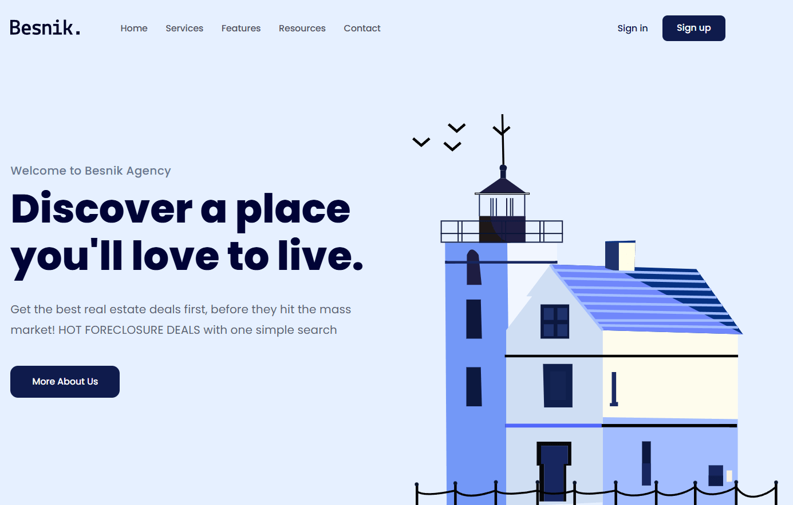

# 🏡 Real Estate Landing Page

A modern **landing page** for a **Real Estate website**, built based on the Figma design.



## 📌 Live Demo
🔗 **[View Live](https://thanhhang31023.github.io/real-estate-landing-page/)**

## 🎨 Figma Design
🔗 **[Figma Prototype](https://www.figma.com/proto/Zs7vjnMWc3jj09J94gr57L/01.-Real-Estate-Landing-Page-Easy-1?node-id=2-334&p=f&m=dev&scaling=min-zoom&content-scaling=fixed&page-id=0%3A1&t=hwMlD4Fon6VAlFV0-1)**

## 📖 About This Project
This project is a **responsive landing page** developed entirely from a Figma design. It focuses on **clean and structured HTML, CSS**, and **responsive design techniques** to ensure a seamless user experience across devices.

## ✨ Features:
- 🎨 **Pixel-perfect Figma to Code conversion**
- 📱 **Fully responsive design**
- ⚡ **Well-structured HTML & CSS**
- 🚀 **Simple and easy-to-read code**

## 🚨 TODO (Future Improvements)
- 🎬 **Add animations & hover effects**
- 🔧 **Optimize performance (Lazy loading images,...)**

## 🛠️ Technologies Used
- **HTML** - Structuring the webpage
- **CSS** - Styling and layout
- **Google Fonts** - Beautiful typography


## 📂 Project Structure
```plaintext
real-estate-landing-page
├── assets
│   ├── css
│   │   ├── reset.css
│   │   ├── styles.css
│   │   ├── responsive.css
│   ├── img
│   ├── icons
│   ├── favicon
├── index.html
├── README.md

```

## 🚀 How to Run Locally

**Open** **Terminal (macOS/Linux)** or **Command Prompt (Windows)** and run:
 
1. **Clone this repository:**
   ```sh

   git clone https://github.com/yourusername/real-estate-landing-page.git

   ```
2. **Navigate to the project directory:**
   ```sh
   cd real-estate-landing-page

   ```
3. **Open the project in VS Code:**
   ```sh
   code .
   ```
4. **Open file `index.html` in your browser.**

## 📬 Contact
- 👤 **NGUYEN THI THANH HANG**
- 📧 **thanhhang31023@gmail.com**
